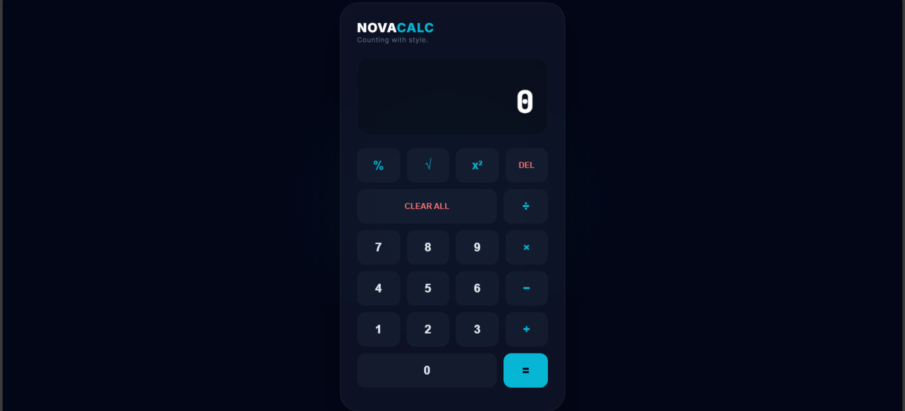

# 🌌 NovaCalculate Pro — 2026 Edition
> **A high-fidelity web instrument where visual tranquility meets mathematical precision.**

[](https://github.com/SOVERNBAEZIT/novacalculate/stargazers)
[](https://sovernbaezit.github.io/novacalculate/beginner/)

---

## 📸 Preview


## 📖 Tentang Proyek
**NovaCalculate Pro** lahir dari keinginan untuk mendefinisikan ulang bagaimana sebuah alat hitung digital seharusnya dirasakan. Di saat banyak aplikasi terjebak dalam desain yang terlalu ramai, proyek ini mengambil langkah berbeda dengan mengusung filosofi **"Visual Tranquility"**.

Melalui pendekatan **Glassmorphism** dan **Soft-UI**, antarmuka ini dirancang untuk "melesap" ke dalam latar belakang, memberikan kenyamanan maksimal bagi mata tanpa mengorbankan fungsionalitas. Setiap transisi angka dan penekanan tombol dioptimalkan untuk memberikan respons yang taktil dan elegan.

### ✨ Fitur Utama
* **Deep Glassmorphism**: Implementasi `backdrop-filter` yang presisi untuk menciptakan efek kaca transparan yang mewah.
* **Refined Logic**: Dibangun di atas *Vanilla JavaScript* yang dioptimalkan untuk menangani operasi matematika dengan akurasi tinggi.
* **Subtle Motion**: Animasi background `floatingWave` yang tenang, memberikan kesan aplikasi yang hidup namun tetap profesional.
* **Scientific-Lite**: Dukungan penuh untuk kalkulasi Akar Kuadrat (√), Persen (%), dan Eksponen (x²).

---

## 🛠️ Jantung Teknologi
Dalam pengembangan proyek ini, fokus utama adalah efisiensi dan performa murni. Itulah sebabnya saya memilih untuk tidak menggunakan *library* eksternal, melainkan memaksimalkan potensi bahasa pemrograman web standar.

* **Core Engine**: Vanilla JavaScript (ES6+) — Cepat, ringan, dan andal.
* **Visual Styling**: Modern CSS3 (Advanced Grid, Flexbox, & Keyframe Animations).
* **Typography**: Menggunakan **Inter** untuk UI yang modern dan **JetBrains Mono** untuk visualisasi angka yang tegas.

---

## 📂 Struktur Proyek
```text
novacalculate/
├── picturenovacalc.png    # Gambar sampul dokumentasi
├── README.md              # Dokumentasi teknis
└── beginner/              # Source code inti
    ├── index.html         # Struktur semantik
    ├── style.css          # Logika visual & estetika
    └── script.js          # Arsitektur kalkulasi